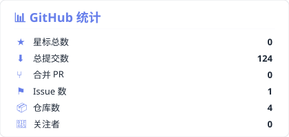
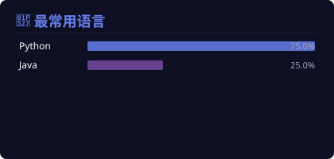

<!-- 纯第一方方案：所有 SVG 由 GitHub Actions 自动生成，存储在仓库中，由 GitHub CDN 提供 -->
<!-- 不依赖任何第三方服务（Vercel/Heroku/demolab/shields.io 等），永不限流 -->

  

 

  

 

## 🚛 关于我

我是一名 **Euro Truck Simulator 2** 游戏爱好者和工具开发者，专注于为 ETS2/TruckersMP 社区打造实用的辅助工具。

- 🎮 热爱欧卡模拟驾驶游戏
- 💻 使用 Python / Java 开发游戏辅助工具
- 🌍 为 TruckersMP 联机社区提供帮助
- ⚡ 持续优化和更新项目

 

## 🐍 贡献贪吃蛇

<picture>
  <source media="(prefers-color-scheme: dark)" srcset="https://raw.githubusercontent.com/BunNiuNai/BunNiuNai/output/github-contribution-grid-snake-dark.svg" />
  <source media="(prefers-color-scheme: light)" srcset="https://raw.githubusercontent.com/BunNiuNai/BunNiuNai/output/github-contribution-grid-snake.svg" />
  
</picture>

 

## 🛠️ 技术栈

  

 

## 📊 GitHub 统计

  
  

 

  

 

## 📫 联系我

| 平台 | 链接 |
|------|------|
| **GitHub** | [github.com/BunNiuNai](https://github.com/BunNiuNai) |
| **Kook** | [kook.vip/WJZ5Sj](https://kook.vip/WJZ5Sj) |

 

  

